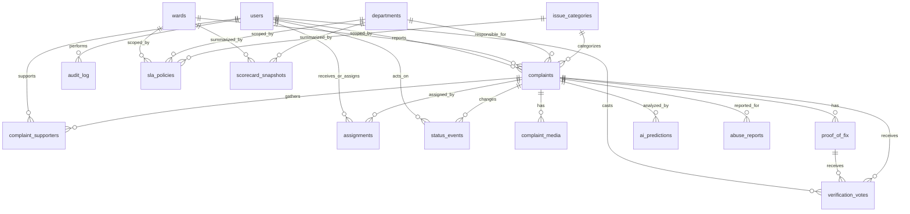
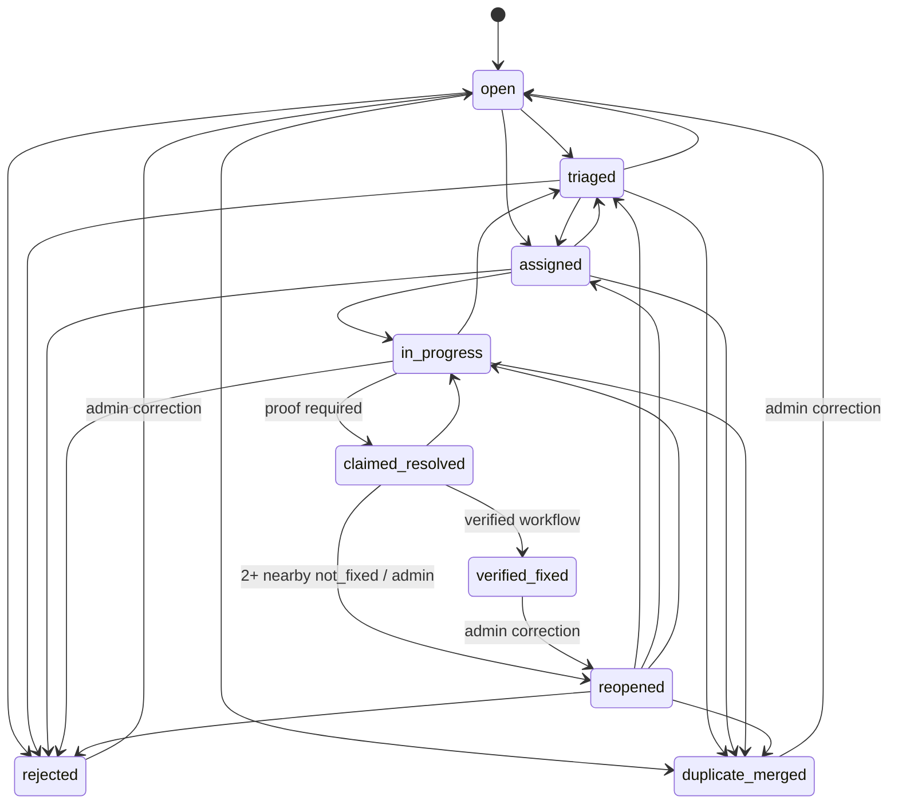

# NagarDrishti Data Model and PostgreSQL Schema

## 1. Model conventions
- PostgreSQL with PostGIS is the source of truth. `uuid` primary keys reduce predictable identifiers; external API IDs may be opaque strings derived from UUIDs.
- Timestamps use `timestamptz` in UTC. Display localization occurs at the client.
- `complaints.status` is mutable only through the workflow service; `status_events` is append-only and hash-chained.
- Original coordinates and media remain private. `public_location` is a coarsened geometry; public APIs do not return `location_exact`.
- Category labels are stored exactly as the eight brief-approved values, using a table rather than a database enum so department routing/configuration is data-driven.
- `jsonb` stores extensible explainability/metrics payloads while typed columns cover primary query dimensions.

## 2. Entity-relationship description
A `user` has one role and may create many `complaints`, support many complaints through `complaint_supporters`, submit verification votes, and file abuse reports. A complaint belongs to one `ward`, one `issue_category`, and an optional responsible `department`; it has a private point and public coarsened point. It has many media records, status events, assignments, proof-of-fix records, AI predictions, supporters, verification votes, and abuse reports.

A proof-of-fix belongs to one complaint and can contain several `complaint_media` records designated `proof_after`; votes refer to both complaint and proof. An SLA policy selects category/department/ward scope and is used by snapshot computation. `scorecard_snapshots` are immutable materialized metric records per ward or department. `audit_log` records security and moderation activity independently from status events. Duplicate merging retains a source complaint, records a transition to `duplicate_merged`, and points `merged_into_complaint_id` at its canonical complaint.

## 3. Entity relationship diagram


## 4. Lifecycle enum and transition rules
### 4.1 Enum definition
The lifecycle names are fixed for MVP:
`open`, `triaged`, `assigned`, `in_progress`, `claimed_resolved`, `verified_fixed`, `reopened`, `rejected`, `duplicate_merged`.

### 4.2 Status transition table
| From | Allowed to | Actor/rule | Required evidence/condition |
|---|---|---|---|
| `open` | `triaged`, `assigned`, `rejected`, `duplicate_merged` | Officer/admin; admin for merge | Triage note for triage; reason for reject/merge. |
| `triaged` | `assigned`, `rejected`, `duplicate_merged`, `open` | Officer/admin | Assignment target for assigned; reason for reject/merge; open only for correction. |
| `assigned` | `in_progress`, `triaged`, `rejected`, `duplicate_merged` | Assigned officer/admin | Assignment exists; reason where required. |
| `in_progress` | `claimed_resolved`, `triaged`, `rejected`, `duplicate_merged` | Assigned officer/admin | At least one active proof-of-fix for claimed resolution. |
| `claimed_resolved` | `verified_fixed`, `reopened`, `in_progress` | Verification workflow/admin | Verified fixed requires configured positive verification/manual reviewed rule; reopened automatically at 2+ eligible nearby `not_fixed` votes or admin decision; in progress needs documented correction. |
| `reopened` | `triaged`, `assigned`, `in_progress`, `rejected`, `duplicate_merged` | Officer/admin | Reopen reason/status event retained; standard workflow resumes. |
| `verified_fixed` | `reopened` | Admin or later valid verification exception | Documented corrective reason; no silent reopen. |
| `rejected` | `open` | Admin | Corrective reversal reason. |
| `duplicate_merged` | `open` | Admin | Unmerge/correction reason; canonical link cleared. |

Terminal in normal user flow: `verified_fixed`, `rejected`, and `duplicate_merged`. Only admin corrective actions may leave them. A status transition must update `complaints.status`, insert `status_events`, and insert `audit_log` atomically.



## 5. PostgreSQL DDL
```sql
CREATE EXTENSION IF NOT EXISTS postgis;
CREATE EXTENSION IF NOT EXISTS pgcrypto;

CREATE TYPE user_role AS ENUM ('citizen', 'officer', 'admin');
CREATE TYPE complaint_status AS ENUM (
  'open', 'triaged', 'assigned', 'in_progress', 'claimed_resolved',
  'verified_fixed', 'reopened', 'rejected', 'duplicate_merged'
);
CREATE TYPE media_kind AS ENUM ('complaint_before', 'proof_after', 'voice_note', 'public_derivative');
CREATE TYPE verification_choice AS ENUM ('fixed', 'not_fixed', 'unsure');
CREATE TYPE prediction_state AS ENUM ('pending', 'completed', 'failed', 'skipped');
CREATE TYPE abuse_target_type AS ENUM ('complaint', 'media', 'user', 'proof_of_fix', 'comment');
CREATE TYPE abuse_state AS ENUM ('open', 'reviewing', 'actioned', 'dismissed');
CREATE TYPE scorecard_scope AS ENUM ('ward', 'department');

CREATE TABLE users (
  id uuid PRIMARY KEY DEFAULT gen_random_uuid(),
  role user_role NOT NULL DEFAULT 'citizen',
  phone_hash text UNIQUE,
  display_name text,
  preferred_language varchar(8) NOT NULL DEFAULT 'en',
  consent_version text,
  consented_at timestamptz,
  is_active boolean NOT NULL DEFAULT true,
  created_at timestamptz NOT NULL DEFAULT now(),
  updated_at timestamptz NOT NULL DEFAULT now(),
  CHECK (preferred_language IN ('en', 'hi', 'mr')),
  CHECK (role <> 'citizen' OR phone_hash IS NOT NULL)
);

CREATE TABLE wards (
  id uuid PRIMARY KEY DEFAULT gen_random_uuid(),
  ward_code text NOT NULL UNIQUE,
  ward_name text NOT NULL,
  city_name text NOT NULL DEFAULT 'Pune',
  boundary geometry(MultiPolygon, 4326) NOT NULL,
  centroid geometry(Point, 4326),
  is_active boolean NOT NULL DEFAULT true,
  created_at timestamptz NOT NULL DEFAULT now(),
  CHECK (ST_SRID(boundary) = 4326)
);
CREATE INDEX idx_wards_boundary_gist ON wards USING gist(boundary);

CREATE TABLE departments (
  id uuid PRIMARY KEY DEFAULT gen_random_uuid(),
  department_code text NOT NULL UNIQUE,
  department_name text NOT NULL UNIQUE,
  public_name text NOT NULL,
  contact_metadata jsonb NOT NULL DEFAULT '{}'::jsonb,
  is_active boolean NOT NULL DEFAULT true,
  created_at timestamptz NOT NULL DEFAULT now()
);

CREATE TABLE issue_categories (
  id smallserial PRIMARY KEY,
  category_key text NOT NULL UNIQUE,
  display_name text NOT NULL,
  default_department_id uuid REFERENCES departments(id),
  default_harm_weight numeric(5,2) NOT NULL DEFAULT 1.00,
  is_active boolean NOT NULL DEFAULT true,
  created_at timestamptz NOT NULL DEFAULT now(),
  CHECK (category_key IN (
    'pothole/road', 'garbage/waste', 'drainage/sewage', 'water supply',
    'streetlight/electrical', 'stray animals', 'encroachment', 'other'
  )),
  CHECK (default_harm_weight > 0)
);

CREATE TABLE complaints (
  id uuid PRIMARY KEY DEFAULT gen_random_uuid(),
  public_id text NOT NULL UNIQUE DEFAULT encode(gen_random_bytes(9), 'hex'),
  reporter_user_id uuid NOT NULL REFERENCES users(id),
  ward_id uuid REFERENCES wards(id),
  category_id smallint NOT NULL REFERENCES issue_categories(id),
  department_id uuid REFERENCES departments(id),
  status complaint_status NOT NULL DEFAULT 'open',
  title text,
  description_text text,
  original_language varchar(8) NOT NULL DEFAULT 'en',
  location_exact geometry(Point, 4326),
  public_location geometry(Point, 4326),
  h3_cell text,
  location_accuracy_m numeric(10,2),
  location_source text NOT NULL DEFAULT 'manual_pin',
  urgency_tier smallint,
  urgency_explanation text,
  analysis_state prediction_state NOT NULL DEFAULT 'pending',
  merged_into_complaint_id uuid REFERENCES complaints(id),
  submitted_at timestamptz NOT NULL DEFAULT now(),
  updated_at timestamptz NOT NULL DEFAULT now(),
  claimed_resolved_at timestamptz,
  verified_fixed_at timestamptz,
  rejected_reason text,
  CHECK (original_language IN ('en', 'hi', 'mr')),
  CHECK (urgency_tier IS NULL OR urgency_tier BETWEEN 1 AND 4),
  CHECK (location_exact IS NULL OR ST_SRID(location_exact) = 4326),
  CHECK (public_location IS NULL OR ST_SRID(public_location) = 4326),
  CHECK (status <> 'duplicate_merged' OR merged_into_complaint_id IS NOT NULL),
  CHECK (merged_into_complaint_id IS NULL OR merged_into_complaint_id <> id)
);
CREATE INDEX idx_complaints_status_updated ON complaints(status, updated_at DESC);
CREATE INDEX idx_complaints_ward_status ON complaints(ward_id, status, submitted_at DESC);
CREATE INDEX idx_complaints_department_status ON complaints(department_id, status, submitted_at DESC);
CREATE INDEX idx_complaints_category_status ON complaints(category_id, status);
CREATE INDEX idx_complaints_location_exact_gist ON complaints USING gist(location_exact);
CREATE INDEX idx_complaints_public_location_gist ON complaints USING gist(public_location);
CREATE INDEX idx_complaints_h3_cell ON complaints(h3_cell);
CREATE INDEX idx_complaints_active_partial ON complaints(submitted_at DESC)
  WHERE status IN ('open', 'triaged', 'assigned', 'in_progress', 'claimed_resolved', 'reopened');

CREATE TABLE complaint_media (
  id uuid PRIMARY KEY DEFAULT gen_random_uuid(),
  complaint_id uuid NOT NULL REFERENCES complaints(id) ON DELETE CASCADE,
  uploaded_by_user_id uuid NOT NULL REFERENCES users(id),
  kind media_kind NOT NULL,
  storage_key_private text NOT NULL UNIQUE,
  storage_key_public_derivative text,
  mime_type text NOT NULL,
  bytes bigint NOT NULL,
  sha256 char(64) NOT NULL,
  width_px integer,
  height_px integer,
  captured_at timestamptz,
  exif_gps geometry(Point, 4326),
  exif_summary jsonb NOT NULL DEFAULT '{}'::jsonb,
  redaction_state text NOT NULL DEFAULT 'pending',
  upload_state text NOT NULL DEFAULT 'complete',
  created_at timestamptz NOT NULL DEFAULT now(),
  CHECK (bytes > 0),
  CHECK (width_px IS NULL OR width_px > 0),
  CHECK (height_px IS NULL OR height_px > 0),
  CHECK (exif_gps IS NULL OR ST_SRID(exif_gps) = 4326),
  CHECK (redaction_state IN ('pending', 'ready', 'withheld', 'failed')),
  CHECK (upload_state IN ('pending', 'complete', 'failed', 'quarantined'))
);
CREATE INDEX idx_media_complaint_kind ON complaint_media(complaint_id, kind, created_at);
CREATE INDEX idx_media_exif_gps_gist ON complaint_media USING gist(exif_gps);

CREATE TABLE complaint_supporters (
  complaint_id uuid NOT NULL REFERENCES complaints(id) ON DELETE CASCADE,
  user_id uuid NOT NULL REFERENCES users(id) ON DELETE CASCADE,
  supported_at timestamptz NOT NULL DEFAULT now(),
  proximity_verified boolean NOT NULL DEFAULT false,
  PRIMARY KEY (complaint_id, user_id)
);
CREATE INDEX idx_supporters_user ON complaint_supporters(user_id, supported_at DESC);

CREATE TABLE status_events (
  id uuid PRIMARY KEY DEFAULT gen_random_uuid(),
  complaint_id uuid NOT NULL REFERENCES complaints(id),
  sequence_no integer NOT NULL,
  from_status complaint_status,
  to_status complaint_status NOT NULL,
  actor_user_id uuid REFERENCES users(id),
  actor_role user_role,
  reason text,
  event_metadata jsonb NOT NULL DEFAULT '{}'::jsonb,
  occurred_at timestamptz NOT NULL DEFAULT now(),
  prev_hash char(64),
  event_hash char(64) NOT NULL,
  PRIMARY KEY (id),
  UNIQUE (complaint_id, sequence_no),
  UNIQUE (complaint_id, event_hash),
  CHECK (sequence_no >= 1),
  CHECK (length(event_hash) = 64),
  CHECK (prev_hash IS NULL OR length(prev_hash) = 64),
  CHECK ((sequence_no = 1 AND prev_hash IS NULL) OR (sequence_no > 1 AND prev_hash IS NOT NULL))
);
CREATE INDEX idx_status_events_complaint_time ON status_events(complaint_id, occurred_at, sequence_no);

CREATE TABLE assignments (
  id uuid PRIMARY KEY DEFAULT gen_random_uuid(),
  complaint_id uuid NOT NULL REFERENCES complaints(id),
  assigned_to_user_id uuid NOT NULL REFERENCES users(id),
  assigned_by_user_id uuid NOT NULL REFERENCES users(id),
  assigned_department_id uuid REFERENCES departments(id),
  assigned_at timestamptz NOT NULL DEFAULT now(),
  unassigned_at timestamptz,
  note text,
  is_current boolean NOT NULL DEFAULT true,
  CHECK (unassigned_at IS NULL OR unassigned_at >= assigned_at)
);
CREATE UNIQUE INDEX uq_assignments_current_per_complaint ON assignments(complaint_id) WHERE is_current;
CREATE INDEX idx_assignments_officer_current ON assignments(assigned_to_user_id, is_current, assigned_at DESC);

CREATE TABLE proof_of_fix (
  id uuid PRIMARY KEY DEFAULT gen_random_uuid(),
  complaint_id uuid NOT NULL REFERENCES complaints(id),
  uploaded_by_user_id uuid NOT NULL REFERENCES users(id),
  note text,
  claimed_captured_at timestamptz,
  claimed_location geometry(Point, 4326),
  m5_risk_level smallint,
  m5_summary jsonb NOT NULL DEFAULT '{}'::jsonb,
  submitted_at timestamptz NOT NULL DEFAULT now(),
  is_active boolean NOT NULL DEFAULT true,
  CHECK (m5_risk_level IS NULL OR m5_risk_level BETWEEN 0 AND 3),
  CHECK (claimed_location IS NULL OR ST_SRID(claimed_location) = 4326)
);
CREATE INDEX idx_proof_complaint_active ON proof_of_fix(complaint_id, is_active, submitted_at DESC);

CREATE TABLE proof_of_fix_media (
  proof_of_fix_id uuid NOT NULL REFERENCES proof_of_fix(id) ON DELETE CASCADE,
  media_id uuid NOT NULL REFERENCES complaint_media(id) ON DELETE RESTRICT,
  PRIMARY KEY (proof_of_fix_id, media_id)
);

CREATE TABLE verification_votes (
  id uuid PRIMARY KEY DEFAULT gen_random_uuid(),
  complaint_id uuid NOT NULL REFERENCES complaints(id),
  proof_of_fix_id uuid NOT NULL REFERENCES proof_of_fix(id),
  voter_user_id uuid NOT NULL REFERENCES users(id),
  choice verification_choice NOT NULL,
  eligibility_distance_m numeric(10,2),
  is_eligible_nearby boolean NOT NULL DEFAULT false,
  note text,
  created_at timestamptz NOT NULL DEFAULT now(),
  UNIQUE (proof_of_fix_id, voter_user_id)
);
CREATE INDEX idx_verification_votes_proof_choice ON verification_votes(proof_of_fix_id, choice, is_eligible_nearby);
CREATE INDEX idx_verification_votes_complaint ON verification_votes(complaint_id, created_at DESC);

CREATE TABLE sla_policies (
  id uuid PRIMARY KEY DEFAULT gen_random_uuid(),
  policy_name text NOT NULL,
  ward_id uuid REFERENCES wards(id),
  department_id uuid REFERENCES departments(id),
  category_id smallint REFERENCES issue_categories(id),
  acknowledgement_hours integer,
  resolution_hours integer NOT NULL,
  effective_from timestamptz NOT NULL,
  effective_to timestamptz,
  policy_version text NOT NULL,
  is_active boolean NOT NULL DEFAULT true,
  created_at timestamptz NOT NULL DEFAULT now(),
  CHECK (acknowledgement_hours IS NULL OR acknowledgement_hours > 0),
  CHECK (resolution_hours > 0),
  CHECK (effective_to IS NULL OR effective_to > effective_from)
);
CREATE INDEX idx_sla_policy_lookup ON sla_policies(ward_id, department_id, category_id, effective_from DESC)
  WHERE is_active;

CREATE TABLE scorecard_snapshots (
  id uuid PRIMARY KEY DEFAULT gen_random_uuid(),
  scope scorecard_scope NOT NULL,
  ward_id uuid REFERENCES wards(id),
  department_id uuid REFERENCES departments(id),
  window_start timestamptz NOT NULL,
  window_end timestamptz NOT NULL,
  generated_at timestamptz NOT NULL DEFAULT now(),
  method_version text NOT NULL,
  data_version text NOT NULL,
  metrics jsonb NOT NULL,
  flags jsonb NOT NULL DEFAULT '[]'::jsonb,
  is_public boolean NOT NULL DEFAULT true,
  CHECK (window_end > window_start),
  CHECK ((scope = 'ward' AND ward_id IS NOT NULL AND department_id IS NULL)
      OR (scope = 'department' AND department_id IS NOT NULL AND ward_id IS NULL))
);
CREATE UNIQUE INDEX uq_scorecard_snapshot_scope_window_method
  ON scorecard_snapshots(scope, COALESCE(ward_id::text, department_id::text), window_start, window_end, method_version);
CREATE INDEX idx_scorecard_public_latest ON scorecard_snapshots(scope, generated_at DESC) WHERE is_public;

CREATE TABLE ai_predictions (
  id uuid PRIMARY KEY DEFAULT gen_random_uuid(),
  complaint_id uuid REFERENCES complaints(id) ON DELETE CASCADE,
  proof_of_fix_id uuid REFERENCES proof_of_fix(id) ON DELETE CASCADE,
  media_id uuid REFERENCES complaint_media(id) ON DELETE CASCADE,
  module_id varchar(4) NOT NULL,
  task_name text NOT NULL,
  model_name text NOT NULL,
  model_version text NOT NULL,
  input_checksum char(64),
  state prediction_state NOT NULL DEFAULT 'pending',
  confidence numeric(6,5),
  label text,
  explanation jsonb NOT NULL DEFAULT '{}'::jsonb,
  output jsonb NOT NULL DEFAULT '{}'::jsonb,
  error_summary text,
  created_at timestamptz NOT NULL DEFAULT now(),
  completed_at timestamptz,
  CHECK (module_id IN ('M1', 'M2', 'M3', 'M4', 'M5', 'M6', 'M7')),
  CHECK (confidence IS NULL OR (confidence >= 0 AND confidence <= 1)),
  CHECK (complaint_id IS NOT NULL OR proof_of_fix_id IS NOT NULL OR media_id IS NOT NULL)
);
CREATE INDEX idx_ai_predictions_complaint_module ON ai_predictions(complaint_id, module_id, created_at DESC);
CREATE INDEX idx_ai_predictions_proof_module ON ai_predictions(proof_of_fix_id, module_id, created_at DESC);

CREATE TABLE audit_log (
  id bigserial PRIMARY KEY,
  actor_user_id uuid REFERENCES users(id),
  actor_role user_role,
  action text NOT NULL,
  target_type text NOT NULL,
  target_id uuid,
  request_id uuid,
  ip_hash text,
  metadata jsonb NOT NULL DEFAULT '{}'::jsonb,
  occurred_at timestamptz NOT NULL DEFAULT now(),
  CHECK (length(action) > 0)
);
CREATE INDEX idx_audit_target_time ON audit_log(target_type, target_id, occurred_at DESC);
CREATE INDEX idx_audit_actor_time ON audit_log(actor_user_id, occurred_at DESC);

CREATE TABLE abuse_reports (
  id uuid PRIMARY KEY DEFAULT gen_random_uuid(),
  reporter_user_id uuid NOT NULL REFERENCES users(id),
  target_type abuse_target_type NOT NULL,
  target_id uuid NOT NULL,
  reason_code text NOT NULL,
  detail text,
  state abuse_state NOT NULL DEFAULT 'open',
  reviewed_by_user_id uuid REFERENCES users(id),
  reviewed_at timestamptz,
  moderation_reason text,
  created_at timestamptz NOT NULL DEFAULT now(),
  CHECK ((state IN ('open', 'reviewing')) OR reviewed_at IS NOT NULL)
);
CREATE INDEX idx_abuse_reports_state_time ON abuse_reports(state, created_at);
CREATE INDEX idx_abuse_reports_target ON abuse_reports(target_type, target_id);
```

## 6. Implementation notes
### 6.1 Hash-chain event construction
For each complaint, lock the complaint/event sequence during a status transaction. Compute `event_hash` as SHA-256 over a canonical serialization of complaint ID, sequence number, prior hash (or empty), from/to status, actor ID, occurred time in normalized UTC, reason, and canonicalized metadata. The initial event has `sequence_no=1` and `prev_hash=NULL`; every later event stores the prior event hash. A periodic integrity job recalculates the chain ordered by `sequence_no` and reports mismatch without silently repairing it.

PostgreSQL constraints cannot fully enforce cross-row transition policy or the required proof media. Implement those in the workflow service with transactions and database triggers only where the team can test them thoroughly. Restrict direct `UPDATE complaints SET status` privileges from the runtime API role.

### 6.2 H3 cell indexing
Store `h3_cell` at a selected resolution appropriate to the demonstration area and privacy policy. Use it for candidate prefiltering, map aggregation, and cache keys; use PostGIS `ST_DWithin` on geography for final distance checks. Do not expose a cell resolution that makes a residence readily identifiable. The public map may emit a cell centroid or a jittered/coarsened point rather than the original geometry. Index `h3_cell` with B-tree; retain GiST indexes on point geometries for exact authorized queries.

### 6.3 Privacy-preserving location coarsening
1. Accept a consented device/manual exact point only for internal routing/verification where configured.
2. Select the containing ward and H3 cell; generate `public_location` by snapping to a street-segment representation or safe cell centroid/jittered point.
3. Enforce a minimum aggregation/safety rule: if a coarsened representation is too revealing, publish ward-level/list-only visibility until more reports exist or use a broader cell.
4. Strip EXIF from all public derivatives. Public responses expose neither `location_exact`, `exif_gps`, accuracy, uploader ID, phone hash, nor original storage keys.
5. Treat location coarsening as risk reduction, not a guarantee of anonymity; document this limitation in the privacy notice.

### 6.4 Required seed records
Seed the three UI languages, the eight category keys, demo departments, selected ward polygons, SLA policies explicitly labelled demo assumptions, an admin, mock officers, and clearly labelled synthetic complaints. No record should imply that it came from a real municipal backend unless an explicit documented import is later approved.
