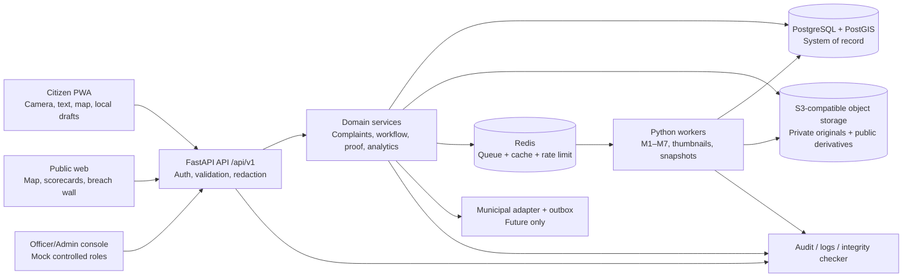
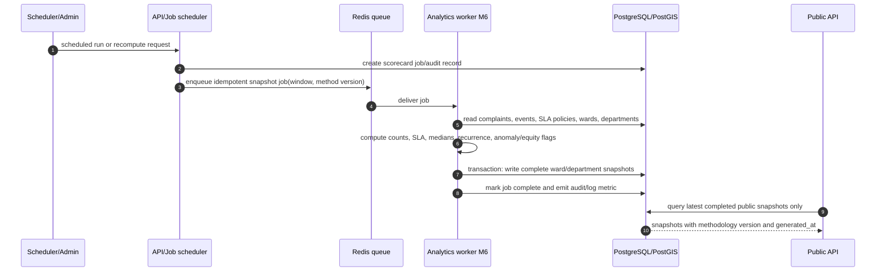

# NagarDrishti System Architecture

## 1. Purpose and deployment posture
NagarDrishti is designed as a small, demonstrable civic-grievance system that remains functional without a municipal partner. The architecture separates citizen input, public transparency, controlled officer operations, AI inference, and data governance. The MVP is not a production government platform: it should run reliably for a course demo and evaluation dataset, make limitations visible, and preserve a clean integration seam for later work.

## 2. Architectural principles
1. **Workflow before models.** A manual workflow must work if every model is unavailable.
2. **Public by default only after redaction.** Public API projections are generated from allow-listed, coarsened fields; they never return private entity records directly.
3. **Evidence is not verdict.** M5 produces suspicion signals; only the workflow and citizen verification can advance or reopen status.
4. **Immutable event history.** Every lifecycle change is an append-only hash-chained `status_event`.
5. **Async AI, synchronous acknowledgement.** Report creation returns immediately and analysis results arrive later.
6. **Configurable demo policies.** Ward boundaries, department mapping, SLAs, thresholds, and model versions are seed/config data, not hard-coded civic claims.
7. **Adapter, not dependency.** Future municipal backends communicate through a bounded adapter interface and outbox, not the core transaction path.

## 3. Layered architecture
| Layer                    | Components                                                                                      | Responsibilities                                                                     | Does not do                                                    |
| ------------------------ | ----------------------------------------------------------------------------------------------- | ------------------------------------------------------------------------------------ | -------------------------------------------------------------- |
| Presentation             | Citizen PWA, public web views, officer/admin console                                            | Capture input, local draft, map/list rendering, role-aware controls, localization.   | Enforce security or authoritatively compute statuses.          |
| Edge/API                 | FastAPI `/api/v1`, auth middleware, request validators, rate limiter                            | JWT validation, schema validation, response redaction, orchestration, OpenAPI.       | Long-running model inference or direct client database access. |
| Domain/application       | Complaint service, workflow engine, support/verification service, moderation, scorecard service | Transactional rules, transition validation, eligibility, audit/event generation.     | Render UI or expose raw storage.                               |
| Intelligence/async       | Redis queue, worker, M1–M7 runners, media preprocessing, snapshot jobs                          | Versioned predictions, embedding/index updates, scheduled analytics, retries.        | Silently make binding civic decisions.                         |
| Persistence              | PostgreSQL/PostGIS, object storage, Redis cache/queue                                           | Relational truth, spatial queries, append-only history, media binaries, cache state. | Business-policy decisions.                                     |
| Integration              | Municipal adapter, outbox records, import/export jobs                                           | Optional sync transformation, status mapping, retry/audit.                           | Block core MVP or assume external API exists.                  |
| Observability/governance | Structured logs, audit log, integrity checker, metrics                                          | Trace activity, detect chain tampering, debug jobs, retain accountability.           | Store secrets/raw OTP values.                                  |

## 4. Component diagram


### ASCII deployment view
```text
[Mobile browser]           [Desktop browser]
      | HTTPS                    | HTTPS
      +-----------+--------------+
                  v
        [FastAPI API container]
             |       |       \
             |       |        +--> [Object storage]
             |       +-----------> [Redis queue/cache]
             v                         |
 [PostgreSQL + PostGIS] <--- [AI/worker container]
             |
             +--> [optional adapter outbox] --> [future PMC/CPGRAMS-style backend]
```

## 5. Core domain ownership
- **Complaint service** creates complaints, owns category/location/user relationships, and exposes private owner projections.
- **Workflow engine** is the only component allowed to change `complaints.status`. It checks transition policy, writes `status_events`, and creates audit records in one database transaction.
- **Media service** creates upload intents, validates metadata, stores original/derivative paths, and grants signed access only to authorized callers.
- **Discovery service** uses PostGIS/H3 and M4 candidate outputs to find nearby active issues; it does not treat a candidate as an automatic merge.
- **Proof service** links after-media to a complaint, triggers M5, controls verification eligibility, and evaluates the two-negative-vote reopen rule.
- **Analytics service** builds immutable scorecard snapshots from configured windows and source data. It creates explainable M6 flags rather than operational commands.
- **Moderation service** manages abuse reports and canonical duplicate merge; merging preserves historical records.

## 6. Request sequence diagrams
### 6.1 Report submission flow
```mermaid
sequenceDiagram
  autonumber
  participant U as Citizen PWA
  participant A as API
  participant D as Complaint service
  participant S as PostgreSQL/PostGIS
  participant M as Object storage
  participant Q as Redis queue
  participant W as AI worker M1–M4/M7

  U->>A: POST media upload intent (JWT, consent)
  A->>D: authorize and validate media metadata
  D->>M: create private upload target
  M-->>U: signed upload URL
  U->>M: upload photo/voice
  U->>A: POST /complaints (location, text, category optional, media IDs)
  A->>D: validate input and normalize coarse location
  D->>S: transaction: complaint=open, initial status_event, media link, audit
  D->>Q: enqueue media preprocess + M1/M2/M3/M4 (+M7 if voice)
  D-->>A: complaint ID and pending analysis state
  A-->>U: 201 Created; show timeline and manual fields
  Q->>W: deliver idempotent analysis job
  W->>S: store versioned ai_predictions and duplicate candidates
  U->>A: GET complaint detail / nearby candidates
  A-->>U: editable suggestions and redacted candidate summaries
```

### 6.2 Proof-of-fix flow
```mermaid
sequenceDiagram
  autonumber
  participant O as Officer console
  participant A as API
  participant P as Proof service
  participant S as PostgreSQL
  participant M as Object storage
  participant Q as Redis queue
  participant W as M5 worker
  participant C as Eligible citizens

  O->>A: upload proof media intent
  A->>M: create private proof upload target
  M-->>O: signed URL
  O->>A: POST proof-of-fix (media, note, capture claims)
  A->>P: authorize officer and validate complaint state
  P->>S: create proof_of_fix; enqueue M5; audit
  P->>Q: M5 proof analysis job
  P->>S: transition in_progress/assigned to claimed_resolved with event
  A-->>O: 201 proof, status=claimed_resolved
  Q->>W: analyze before/after, pHash, embeddings, EXIF/GPS/time
  W->>S: write M5 ai_prediction and proof risk fields
  C->>A: POST verification vote fixed/not_fixed/unsure
  A->>P: verify eligibility and one-vote constraint
  P->>S: store vote; count eligible not_fixed votes
  alt two or more nearby not_fixed votes
    P->>S: transition claimed_resolved to reopened; append event/audit
  end
```

### 6.3 Scorecard computation flow


## 7. Service inventory
| Service | Responsibility | Suggested technology | Owner role |
|---|---|---|---|
| Citizen PWA | Camera-first reporting, local drafts, support/votes, language selection | React + TypeScript or plain JS, service worker | Frontend engineer |
| Public transparency UI | Map, redacted detail, scorecards, breach wall, exports | React/Leaflet/OpenStreetMap | Frontend engineer |
| Officer/admin UI | Queue, assignment, status/proof, moderation | React responsive desktop-first | Full-stack engineer |
| API gateway | REST endpoints, JWT auth, validation, role controls, redaction | FastAPI + Pydantic | Backend engineer |
| Complaint/workflow service | Transactional domain rules and status event chain | Python/FastAPI service layer + SQLAlchemy | Backend engineer |
| Media service | Upload intents, metadata extraction, derivatives, signed retrieval | S3-compatible storage + Pillow/ExifTool-style processing | Backend engineer |
| Discovery service | Nearby lookup, H3/geometry filtering, duplicate candidate retrieval | PostGIS + Python | Backend/ML engineer |
| AI worker | M1–M7 inference, preprocessing, versioned predictions | Python, Celery/RQ/Arq-style worker | ML engineer |
| Analytics scheduler | Scorecards, breach/forgotten views, M6 jobs | Python scheduler + worker | Backend/ML engineer |
| Database | Operational data, geospatial indexes, audit/event history | PostgreSQL 15+ with PostGIS | Backend engineer |
| Queue/cache | Jobs, idempotency locks, response cache, rate-limit counters | Redis | Backend engineer |
| Integration adapter | Future backend mapping and outbox retry | Python ABC + HTTP client | Backend engineer |
| Observability | Structured logs, audit viewer, integrity checker | JSON logs + database audit table | Team lead |

## 8. Async and queue design for AI inference
### 8.1 Jobs
| Job | Trigger | Idempotency key | Output | Retry policy |
|---|---|---|---|---|
| `media.preprocess` | New media uploaded | media ID + derivative version | thumbnail, stripped public derivative, metadata summary | 3 bounded retries; mark failed. |
| `ai.intake` | Complaint created/edited | complaint ID + input checksum + model bundle version | M1/M2/M3 predictions | 2 retries; manual workflow continues. |
| `ai.duplicates` | Complaint location/text/photo changes | complaint ID + active-window version | M4 candidate set/cluster suggestion | 2 retries; nearby geometric query remains. |
| `ai.voice` | Voice media accepted | media ID + ASR version | M7 transcript/confidence | 1 retry; typed fallback. |
| `ai.proof` | Proof-of-fix created | proof ID + input checksum + M5 version | reuse/change/metadata signals | 2 retries; manual review warning. |
| `analytics.snapshot` | Schedule/admin request | scope + time window + method version | scorecard snapshots/M6 flags | 1 retry then job failure alert. |

### 8.2 Worker contract
Each job contains only IDs and safe configuration references, not unbounded media bytes. The worker obtains authorized private media through an internal credential, calculates a checksum, records `started_at`, `completed_at` or `failed_at`, and writes a versioned `ai_predictions` row. Replayed delivery must upsert or no-op based on the idempotency key. Dead-letter records include error class and safe diagnostic text, never credentials or raw OTPs.

### 8.3 Degraded operation
If Redis or a model service fails, report intake commits with `analysis_state=pending` or `failed`; user fields remain editable. Officer status workflows do not wait for M5, but UI shows “automated evidence checks unavailable” rather than a clean proof signal. Scorecards serve the last completed snapshot and display its generation time.

## 9. Caching strategy
| Cache target | Key shape | TTL/invalidation | Notes |
|---|---|---|---|
| Public map tiles/list page | `public:issues:{bbox-or-h3}:{filters}:{page}:{data_version}` | 30–120 seconds; bump `data_version` after public-relevant event | Cache redacted projection only. |
| Complaint public detail | `public:complaint:{id}:{updated_at}` | 60 seconds; invalidate on public status/media change | Never cache owner/private projection in shared key. |
| Ward/department scorecard | `scorecard:{scope}:{id}:{latest_snapshot_id}` | Until new completed snapshot | Snapshots are immutable and safe to cache long. |
| Nearby candidates | `nearby:{h3}:{category?}:{window}` | 30 seconds | Candidate data remains authenticated/redacted as appropriate. |
| JWT revocation/role change | `auth:token:{jti}` / `auth:user:{id}:version` | Token lifetime | Use server check for critical role revocation. |
| Rate limits | `rl:{principal}:{route}:{window}` | Window duration | Redis atomic increments. |

Caching is an optimization, never a source of truth. Workflow writes commit to PostgreSQL first; cache invalidation is best effort and short TTL limits stale public displays.

## 10. Storage layout for images and media
```text
bucket: nagardrishti-media
  private/originals/{yyyy}/{mm}/{complaint_id}/{media_uuid}/source.{ext}
  private/proof/{yyyy}/{mm}/{complaint_id}/{proof_id}/{media_uuid}/source.{ext}
  private/voice/{yyyy}/{mm}/{complaint_id}/{media_uuid}/source.{ext}
  derived/private/{media_uuid}/normalized.jpg
  derived/public/{media_uuid}/redacted-thumbnail.webp
  quarantine/{media_uuid}/source.{ext}
```
- Original citizen/proof media is private and accessed through short-lived signed URLs or an authenticated proxy.
- Ingestion validates type/size, normalizes orientation, extracts a minimal metadata summary, and strips EXIF from public derivatives.
- The public derivative must obscure identifiable faces/vehicle plates if present; if automatic/manual redaction is unavailable, public media is withheld while the issue summary remains visible.
- Database rows store object keys, checksum, dimensions, capture claims, derivative state, and redaction state; they do not expose bucket credentials.
- A deletion/retention process removes content objects where allowed and records an auditable tombstone rather than rewriting history.

## 11. Offline and poor-network PWA handling
1. Cache the application shell, language bundles, icons, and last viewed public scorecard/map list using the service worker.
2. Save a new-report draft locally after each meaningful step: language, consent, text, selected category, approximate pin, and media reference/preview.
3. Do not promise background upload on every browser. If offline, label the report **Saved on this device — submit when online** and retain a visible retry action.
4. On reconnect, request a fresh upload intent before sending media, then submit once with a client-generated idempotency key.
5. Compress/resize image previews client-side where feasible; show file-size/progress and permit “submit without photo” only when typed-description policy allows.
6. Public map falls back to an accessible list of nearby/recent issues; cached data labels its “last updated” time.
7. Never treat a local draft as a filed complaint until API acknowledgement returns a complaint ID.

## 12. Future municipal backend adapter
### 12.1 Integration rules
- Core workflow commits locally first. It writes an `integration_outbox`/audit entry after a successful transaction; a worker attempts external delivery later.
- The adapter maps external status values to NagarDrishti lifecycle values explicitly. Unknown external statuses are stored as external metadata, not silently converted.
- An integration failure never changes a local complaint to rejected/resolved and never blocks citizen visibility.
- Store external ticket ID, request/response metadata summary, retry count, and last error safely; never store credentials in the database.
- Initial implementation is a `NullMunicipalAdapter` that records “not configured.” A simulated adapter may be used for a demo.

### 12.2 Python abstract-base-class sketch
```python
from __future__ import annotations
from abc import ABC, abstractmethod
from dataclasses import dataclass
from datetime import datetime
from typing import Any, Mapping, Optional

@dataclass(frozen=True)
class ExternalTicketRef:
    provider: str
    external_id: str
    created_at: datetime

@dataclass(frozen=True)
class SyncResult:
    ok: bool
    external_id: Optional[str]
    external_status: Optional[str]
    retryable: bool
    message: str
    raw_summary: Mapping[str, Any]

class MunicipalBackendAdapter(ABC):
    """Future CPGRAMS/PMC-style boundary; no live provider assumed for MVP."""

    @abstractmethod
    async def submit_complaint(self, complaint: Mapping[str, Any]) -> SyncResult:
        """Create an external ticket using a redaction/consent-aware payload."""

    @abstractmethod
    async def push_status_event(
        self, external_ref: ExternalTicketRef, event: Mapping[str, Any]
    ) -> SyncResult:
        """Optionally relay an eligible local event to the provider."""

    @abstractmethod
    async def fetch_updates(self, cursor: Optional[str]) -> tuple[list[Mapping[str, Any]], Optional[str]]:
        """Fetch remote events; caller validates mappings before local application."""

    @abstractmethod
    def map_external_status(self, external_status: str) -> Optional[str]:
        """Return one allowed NagarDrishti lifecycle status or None for review."""

class NullMunicipalAdapter(MunicipalBackendAdapter):
    async def submit_complaint(self, complaint):
        return SyncResult(False, None, None, False, "integration not configured", {})
    async def push_status_event(self, external_ref, event):
        return SyncResult(False, external_ref.external_id, None, False, "integration not configured", {})
    async def fetch_updates(self, cursor):
        return [], cursor
    def map_external_status(self, external_status):
        return None
```

## 13. Scalability notes and honest student-scale limits
The MVP should target a few selected wards/campus area, a few thousand demo records, low concurrent use, and a single API/worker instance. PostGIS indexes, pagination, H3 filtering, object-store media, Redis-backed jobs, and immutable snapshots make this scale credible for a demonstration. They do not make the system deployment-ready for a city-wide load.

At student scale, queue latency, cold starts, model memory, media moderation, OTP delivery, and manual review are likely bottlenecks. Run one lightweight inference worker; serialize GPU-heavy tasks; precompute embeddings where possible; cache redacted map results; and compute snapshots on a schedule. A city deployment would additionally require load-balanced API replicas, durable managed queues, multi-zone database/backups, stronger identity/consent governance, operational monitoring, security review, content moderation capacity, multilingual accessibility testing, data-retention governance, and formal agreements with a municipality. These are future operational requirements, not claims for MVP.
